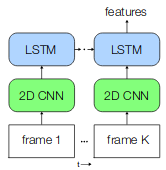

# Code
seminar.py     -- main script for training 
tf_tools.py    -- data pipeline 
eval.py        -- script for evaluating 
lossmetrics.py -- losses and metrics 
models.py      -- cnn_lstm model 
file_tools.py  -- some path helpers 
load_videos.py -- tool for annotation 

# DRAFT! ACR Seminar - Multi-Modal Dietary Intake Monitoring of Free-Living Individuals

## WP3 Intake gesture detection

### Goal

Detection of labels {none, fetch, eat, drink, return} in free living egocentric video footage.

### Method

Baseline Model: ResNet50 CNN-LSTM. The Resnet50 uses imagenet weights as initialization. Layer freezing is possible.

##### Small Dataset

The dataset consists out of ~45 minutes video footage mainly during lunch time. The dataset is very imbalanced. Even during the time with eating and drinking activities the classes of interest are just 8% of the training set. 

##### Pipelines

###### Annotation

The proposed camera saves the recordings in 10 minute *.mkv files (Unfortunately the frame rate of these videos varies). A self made annotation tool is used to annotate the videos and extract the video frames. After that the frames and labels are saved into a binary sequence file called tfrecord. There is the option to encode the frames to *.jpg which reduces in our example the file size from approximate ~1.6GB to ~200MB. The influence of the encoding is show in image 1. The *.tfrecord format has a huge impact on the reading performance and is optimised for tensorflow. There is also the possibility to save multiple images, e.g. optical flow or stereo images into one file which makes it handy. The procedure for these files is to define features and serialize them for every sample into one or multiple files.

###### Dataloader

Before feeding the samples into the model the samples are pre-processed. The datapipeline includes a parser, a sliding window for the sequence data, rejection sampling, shuffeling, batching and standardization. The sliding window stacks n frames (seq_len) with a stride s for the n lstm modules. Rejection sampling is used to adjust the class distributions in our highly imbalanced dataset. Finally the data is standardized to zero mean and unit variance.

## State Jan

### Status

Missed:

- Ethical approval: canceled
- Data collection: Caps not ready

Done:

- Basemodel
- Framework for Data annotation and preprocessing (Data pipeline) 

Todo:

- Delayed: Evaluation, status: critical, reason: not enough data/ computer power
- Data collection

### Problems

The biggest challenges are the highly imbalanced Data and the long training time. Regarding the training time, which is already multiple days (~2h per epoch)  for video time less than 30 minutes after down-sampling, it looks infeasible for two days per person without GPU power. 

The Data distribution problem is difficult.

### Solutions

- Chair should provide gpu power!
- focal loss

#### Focal Loss

*From: https://github.com/umbertogriffo/focal-loss-keras*

[focal loss](https://arxiv.org/abs/1708.02002) down-weights the well-classified examples. This has the net effect of putting more training emphasis on that data that is hard to classify. In a practical setting where we have a data imbalance, our majority class will quickly become well-classified since we have much more data for it. Thus, in order to insure that we also achieve high accuracy on our minority class, we can use the focal loss to give those minority class examples more relative weight during training.

## stuff to remember

nohup python seminar.py &> nohup2.out&
